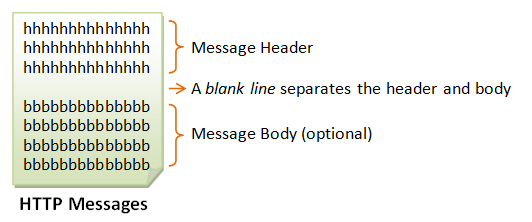

# 0x10. Python - Network #0

## Resources

### Read or watch:
- [HTTP (Hyper Text Transfer Protocol)](https://intranet.alxswe.com/rltoken/rAon_EpQ6PGl8N0plySn4A)
- [HTTP Cookies](https://intranet.alxswe.com/rltoken/MhVCl_0oviQldWPn5oX-NQ)

-------------------------
## 1. HyperText Transfer Protocol (HTTP)
HTTP (Hypertext Transfer Protocol) is perhaps the most popular application protocol used in the Internet (or The WEB).

- HTTP is an asymmetric request-response client-server protocol as illustrated.  An HTTP client sends a request message to an HTTP server.  The server, in turn, returns a response message.  In other words, HTTP is a pull protocol, the client pulls information from the server (instead of server pushes information down to the client).
 - HTTP is a stateless protocol. In other words, the current request does not know what has been done in the previous requests.
 - HTTP permits negotiating of data type and representation, so as to allow systems to be built independently of the data being transferred.

 ## Browser
 Whenever you issue a URL from your browser to get a web resource using HTTP, e.g. http://www.nowhere123.com/index.html, the browser turns the URL into a request message and sends it to the HTTP server. The HTTP server interprets the request message, and returns you an appropriate response message, which is either the resource you requested or an error message.

 ## Uniform Resource Locator (URL)

 A URL (Uniform Resource Locator) is used to uniquely identify a resource over the web. URL has the following syntax:
 ```
 protocol://hostname:port/path-and-file-name
 ```
 There are 4 parts in a URL:
 1. ***Protocol:*** The application-level protocol used by the client and server, e.g., HTTP, FTP, and telnet.
 2. ***Hostname:*** The DNS domain name (e.g., www.nowhere123.com) or IP address (e.g., 192.128.1.2) of the server.
 3. ***Port:*** The TCP port number that the server is listening for incoming requests from the clients.
 4. ***Path-and-file-name:*** The name and location of the requested resource, under the server document base directory.
 
 For example, in the URL http://www.nowhere123.com/docs/index.html, the communication protocol is HTTP; the hostname is www.nowhere123.com. The port number was not specified in the URL, and takes on the default number, which is TCP port 80 for HTTP. The path and file name for the resource to be located is "/docs/index.html".

 ## HTTP Protocol
 As mentioned, whenever you enter a URL in the address box of the browser, the browser translates the URL into a request message according to the specified protocol; and sends the request message to the server.
 When this request message reaches the server, the server can take either one of these actions:
 1. The server interprets the request received, maps the request into a file under the server's document directory, and returns the file requested to the client.
 2. The server interprets the request received, maps the request into a program kept in the server, executes the program, and returns the output of the program to the client.
 3. The request cannot be satisfied, the server returns an error message.
 An example of the HTTP response message is as shown:
```
HTTP/1.1 200 OK
Date: Sun, 18 Oct 2009 08:56:53 GMT
Server: Apache/2.2.14 (Win32)
Last-Modified: Sat, 20 Nov 2004 07:16:26 GMT
ETag: "10000000565a5-2c-3e94b66c2e680"
Accept-Ranges: bytes
Content-Length: 44
Connection: close
Content-Type: text/html
X-Pad: avoid browser bug
  
<html><body><h1>It works!</h1></body></html>
 ```
The browser receives the response message, interprets the message and displays the contents of the message on the browser's window according to the media type of the response (as in the Content-Type response header). Common media type include "text/plain", "text/html", "image/gif", "image/jpeg", "audio/mpeg", "video/mpeg", "application/msword", and "application/pdf".

## HTTP over TCP/IP
- HTTP is a client-server application-level protocol. It typically runs over a TCP/IP connection.
- TCP/IP (Transmission Control Protocol/Internet Protocol) is a set of transport and network-layer protocols for machines to communicate with each other over the network.
- IP (Internet Protocol) is a network-layer protocol, deals with network addressing and routing. In an IP network, each machine is assigned an unique IP address (e.g., 165.1.2.3), and the IP software is responsible for routing a message from the source IP to the destination IP. In IPv4 (IP version 4), the IP address consists of 4 bytes, each ranges from 0 to 255, separated by dots, which is called a quad-dotted form.  This numbering scheme supports up to 4G addresses on the network.  The latest IPv6 (IP version 6) supports more addresses.
- Since memorizing number is difficult for most of the people, an english-like domain name, such as www.nowhere123.com is used instead.
- The DNS (Domain Name Service) translates the domain name into the IP address (via distributed lookup tables).
- A special IP address 127.0.0.1 always refers to your own machine.  It's domian name is "localhost" and can be used for local loopback testing.
- TCP (Transmission Control Protocol) is a transport-layer protocol, responsible for establish a connection between two machines.
- TCP consists of 2 protocols: TCP and UDP (User Datagram Package).
- TCP is reliable, each packet has a sequence number, and an acknowledgement is expected.  A packet will be re-transmitted if it is not received by the receiver.  Packet delivery is guaranteed in TCP.
- UDP does not guarantee packet delivery, and is therefore not reliable.  However, UDP has less network overhead and can be used for applications such as video and audio streaming, where reliability is not critical.

## HTTP Request and Response Messages 
HTTP client and server communicate by sending text messages. The client sends a request message to the server.  The server, in turn, returns a response message.
An HTTP message consists of a message header and an optional message body, separated by a blank line, as illustrated below:


## HTTP Request Message

The format of an HTTP request message is as follow:


### Request Line

The first line of the header is called the request line, followed by optional request headers.
The request line has the following syntax:
```
request-method-name request-URI HTTP-version
```
- *request-method-name*: HTTP protocol defines a set of request methods, e.g., *GET*, POST, HEAD, and OPTIONS. The client can use one of these methods to send a request to the server.
- *request-URI*: specifies the resource requested.
- *HTTP-version*: Two versions are currently in use: HTTP/1.0 and HTTP/1.1.

**Examples of request line are:**
```
GET /test.html HTTP/1.1
HEAD /query.html HTTP/1.0
POST /index.html HTTP/1.1
```
## Request Headers

The request headers are in the form of name:value pairs. Multiple values, separated by commas, can be specified.
```
request-header-name: request-header-value1, request-header-value2, ...
```
**Examples of request headers are:**
```
Host: www.xyz.com
Connection: Keep-Alive
Accept: image/gif, image/jpeg, */*
Accept-Language: us-en, fr, cn
```


## HTTP Response Message

The format of the HTTP response message is as follows:


### Status Line
The status line has the following syntax:
```
HTTP-version status-code reason-phrase
```
